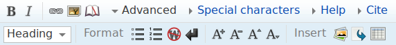
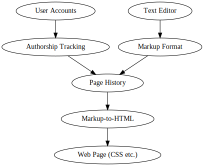
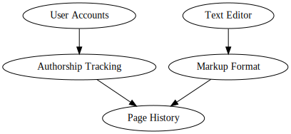
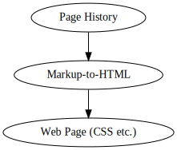

")

## Intro

Wikis are an excellent general purpose organization and publishing tool, probably the best we currently have. Yet they suffer from two serious problems: (1) bad software and (2) brutal edit wars. Let's rethink the concept of the wiki, find the causes of these two problems, and fix them.

## Traditional Wikis

The traditional wiki is a website, and it provides the following:

+ User Accounts
+ Authorship Tracking
+ Page History
+ Text Editor
+ Markup Format
+ Output Templating

Initial reaction -- this is a long list. The traditional wiki isn't modular tool, it's a _contraption_. We already have our answer to (1) -- most wiki software (like MediaWiki) is bad because its requirements list is super long.

Now let's drill down.

### The Good Parts

Wikis do a great job publishing the specs of their markup formats. MediaWiki's (and by extension Wikipedia's) is [here](https://en.wikipedia.org/wiki/Help:Wiki_markup). This is excellent.

Also, the output format (HTML and CSS) is the right choice. We take it for granted, but wikis could be outputting PDFs like academic journals.

### The Okay Parts

Per-site user accounts are a real drawback. They're so common we don't notice them, but it would be much nicer to be able to leave them out.

This is very possible. Federated services like email don't require a user account for every server you interact with. Distributed services like BitTorrent don't require them at all.

Bundling a text editor with a wiki installation isn't great either. Ideally our wiki could just publish the set of markup formats it supports. The user's machine could then use that information to select an editor. It's sad that wikis have to know about this stuff:

But both of these decisions make sense in the context of accessibility. Accessibility is one of the top goals of the traditional wiki. It's meant to be useful without installing any software whatsoever. Seemingly it succeeds.

We'll come back to accessibility later.

### What is a Page?

So we have a great spec for our markup. What's the spec for a whole page? Not just the current markup, but also history and contributors?

Again, here's MediaWiki's: [export-0.6.xsd](export-0.6.xsd).

And here's [an example page](1910-goodall-cup-finals-page.xml).

First thought: it's good they have a spec.

Second thought: the spec is totally ad-hoc. I've never seen a tool that works on MediaWiki export-0.6 XML documents.

Third thought: there's been some horrible collapse of mindset. The spec is named _export_-0.6.xsd.

### Crack in the Foundation

Traditional wiki design is actually super weird.

A natural design would be to build most of the tooling around single pages. To start a new wiki simply create a `.page` file in a shared Dropbox folder. Then edit away with PageEditor for a couple weeks. Eventually this grows into dozens of `.page` files, and you and your friends have a full fledged wiki. Or not. Not every idea is worth keeping around. `.page` is perfect for experimentation.

Of course, there's been some kind of oversight. `.page` and PageEditor don't actually exist.

What we have instead is MediaWiki export-0.6 XML documents.

There actually is one tool that works on such documents. It's called MediaWiki and it's 299,000 lines of PHP. You also need a SQL database and a web server. Where's our accessibility now?

### Heart of Darkness

Traditional wikis' accessibility is shallow. Their level of centralization is high. Decisions made with the best intentions have led to two fundamental flaws:

A) There's no way to work on a local copy of a page. Editing can only be done in the context of a running MediaWiki instance.<a href="#fn1" id="ref1">[1]</a>

B) Pages have a many-to-one relationship with wikis. The only pages that can be included in a wiki are the ones active in its database.

At least we've got an answer to question (2).

No wonder we [fight all the time](http://www.gwern.net/In%20Defense%20Of%20Inclusionism). Each author is trapped in with the others like rats in a box. They can't even write locally. Everything goes straight into the box. Then everyone in the box has to agree on exactly what's going to be kept.

Traditional wikis encourage conflict. This is silly and sad.

## The Page-Forkable Wiki

### Definition

A page forkable wiki is a wiki where:

+ The source of a page (which includes history and authorship) can be viewed with a few clicks.

+ The source of a page can be accessed programmatically.

+ The are decent tools to create pages, view their history, and make edits to them in isolation.

### Prototype Implementation

Every specification should have an implementation.

It's actually pretty feasible to make a traditional wiki page-forkable. The hardest part would be writing the page editor, since it involves being able to write and read an ad-hoc version control system.

To avoid this work, the [prototype implementation](https://github.com/seagreen/housejeffries) is based around its own page spec.

Each page in the prototype implementation is a git repo, which contains:

+ A markdown file called `page.md`.
+ Optionally other files such as images, related to the page.

Since the page definition is so off-the-shelf we can immediately start doing interesting things.

Below is the traditional wiki:

The prototype implementation breaks off the page writing process entirely, outsourcing it to a git hosting service:

In detail, authorship tracking and page history are handled by git.<a href="#fn2" id="ref2">[2]</a> Good markup formats already exist. The text editor is provided by the user, and user accounts are provided by the git hosting service.

This doesn't leave much wiki left to write. Information is only flowing in one direction so it uses a static site generator:

Something interesting emerges from this.

In our quest to get editable standalone pages, we got federation for free. One page can be on multiple wikis, and one wiki can aggregate pages from multiple git hosts.

This is fantastic because it allows separation between content creation and curation. Writers can keep their writing under their own control. They can experiment with their pages and be as daring as they want in trying to escape local maxima. For subjective content like tutorials this is an important freedom.

Curators can search anywhere for gems to include in their wikis. Disagreements become less serious since the stakes are reduced (a page being deleted from a particular wiki is much less serious than being removed from the web altogether). Federated systems aren't totally harmonious, but they're a big improvement over the rats-in-the-box relationship of authors in a centralized project.

## Problems

#### With Page-Forkable Wikis

+ Pages no longer have permanent URLs. A page might start its life in a local directory, then move to a Dropbox folder and then onto a server. Each transition will break links to the page.

	The ideal solution is a magnet link-like scheme. Note that it needs to be able to reference not just pages, but also a specific revisions within them (traditional wikis are great about giving each revision a URL).

#### With Federated-Wikis

+ Intra-wiki link handling becomes harder. If links are absolute then users will get bumped around wikis a lot. If links are relative then the page referenced by the link might not be included in a particular wiki.

	The magnet link-like scheme above may help, but it doesn't provide a complete solution. Users expect links to change their browser's _location_ as well as its _contents_.

#### With the Prototype

+ Git is an unfriendly VCS for beginners. For this reason the prototype page-forkable wiki is less accessible than centralized ones. Passing centralized wikis in accessibility will have to wait for later page-forkable wikis, which could use simpler VCSs designed for single documents.

+ The strategy behind this implementation involves handling a lot of git repos. So far this has gone better than expected, but it's not a long term solution (see the previous bullet point).

+ This implementation uses Github. There isn't a machine verified link between Github usernames and git commits. This is a step backwards from centralized wikis where an edit credited to a particular user is guaranteed to be by that user.

## The Future

Someday when everyone owns personal servers even federation won't be necessary. Wikis will be truly decentralized. A wiki will simply consist of a set of hashes referencing edits originating from such servers.

In the meantime page-forkable wikis are a nice small step. Page-forkable, federated wikis are an even bigger improvement, and can be easily built using existing version control programs and hosts. The running wiki site is flashy and has gotten the attention until now, but it's built around the page, and the page can exist without the site.

## Footnotes

[1] "page" here (and throughout the article) includes the current version of the page, the history of its changes, and authorship information for each change. It's trivial to download the current version of a page and edit it locally in a text editor, but I don't think a piece of markup without history has any remaining connection to the idea of a wiki. History is essential to the concept of a wiki page. <a href="#ref1" id="fn1" title="Jump back to footnote 1 in the text.">↩</a>

[2] Git-backed wikis are already an interesting alternative to traditional wikis. However, they're even less page-forkable than traditional repos. Extracting the history of only a single directory from a git repo is difficult with current tooling.<a href="#ref2" id="fn2" title="Jump back to footnote 2 in the text.">↩</a>
